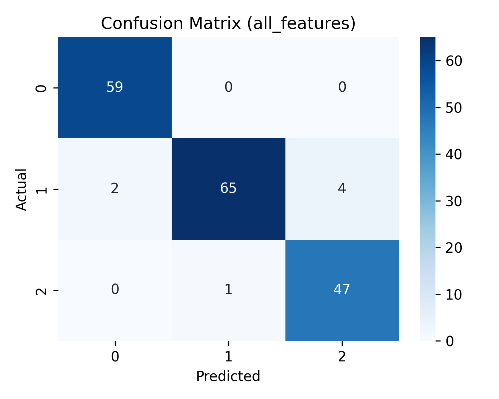
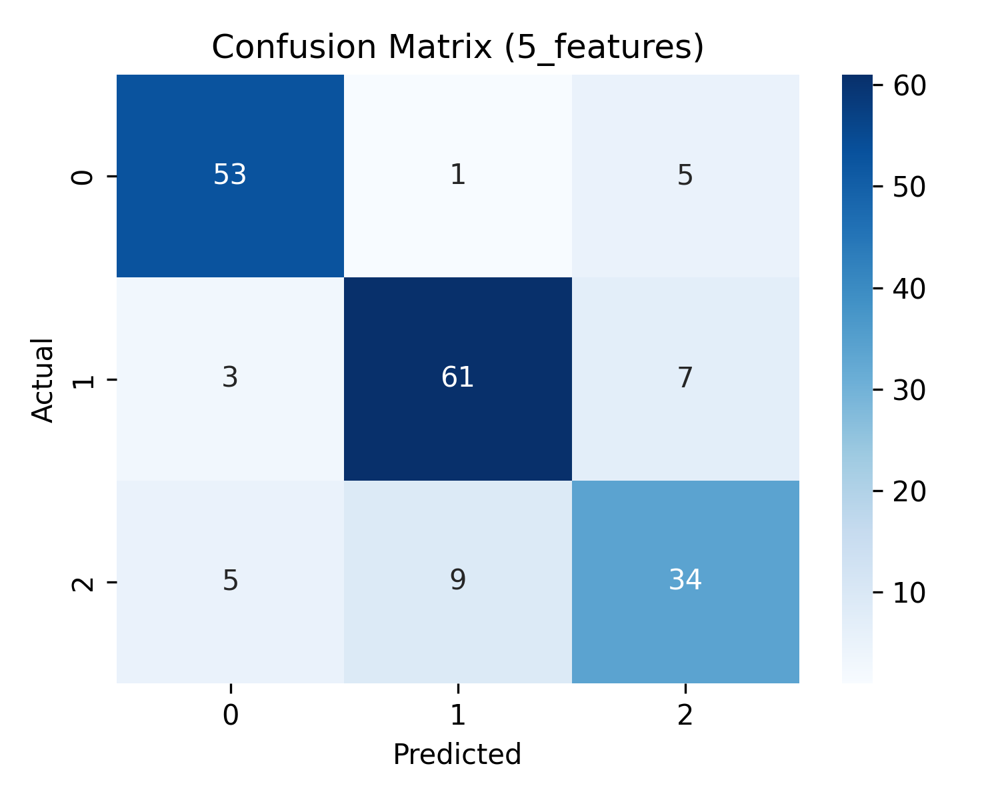

# Wine Classification using SVM
## Project Description
This project uses **Support Vector Machines (SVM)** to classify wines from the Wine Dataset. The dataset contains chemical analyses of wines from three different cultivars, with 13 features per sample.
The goal is to build a model that can predict the wine cultivar based on its chemical composition.

## Dataset

The analysis in this project is based on the **Wine dataset** from the **UCI Machine Learning Repository**.

- **Dataset:** Wine
- **Source:** UCI Machine Learning Repository
- **URL:** https://archive.ics.uci.edu/dataset/109/wine

The dataset contains the results of a chemical analysis of wines grown in the same region in Italy but derived from three different cultivars.

This dataset is used in this repository for educational purposes.
---
## Technologies
- Python 3  
- Pandas, NumPy  
- Scikit-learn (SVM, train_test_split, StratifiedKFold, StandardScaler, confusion_matrix)  
- Markdown (for README)

- ## Model

This project uses a **Support Vector Machine (SVM)** classifier to distinguish between different wine classes.

SVM works by finding a hyperplane that maximally separates the classes in feature space. Different kernels can be used to capture non-linear relationships.
---

## Project Structure
wine-svm-classification/

├── data/

│ └── wine.data

├── results/

│ ├── confusion_matrix_5_features.png

│ └── confusion_matrix_all_features.png

├── notebooks/

│ └── wine_analysis.ipynb 

├── README.md

---
## Execution Steps
1. Load the dataset:
```python
import pandas as pd
data = pd.read_csv("wine.data", header=None)
``` 

2. Select features and target classes: 
```python 
X = data[['x1','x2','x3','x4','x5']].values  # First 5 features
y = data['class'].values
``` 
3. Split data into Train/Validation/Test sets.
4. Train a linear SVM and tune the C parameter using the validation set.
5. Repeat training with random splits to evaluate statistical performance.
6. Train non-linear SVMs (Polynomial, RBF) and compare test errors.
7. Perform 5-fold cross-validation and calculate the confusion matrix.

Results
⦁	The Polynomial SVM achieved the lowest error and was the best classifier for this problem.
⦁	The Linear SVM also performed well, indicating that classes 2 and 3 are almost linearly separable.
⦁	The RBF SVM had higher error and did not fit the data as well.
⦁	Using all features significantly reduces error and improves class separation.

Usage Instructions
1.	Clone the repository:
```bash 
git clone https://github.com/daf-tsal/wine-svm-classification-problem.git
cd wine-svm-classification-problem
``` 
2. Install required libraries: 
```bash 
pip install -r requirements.txt
```
3. Make sure the dataset is located in:
   data/wine.data
4. Open the notebook:
```bash
jupyter notebook
```
5. Run the Python script:
```python
  notebooks/wine_analysis.ipynb
```
6.The results (confusion matrices) will be saved in:
results/

Output includes:
⦁	Validation and test errors for each training run
⦁	Mean and standard deviation of errors
⦁	Confusion matrices for classification evaluation

## Visualizations

### Confusion Matrix (All Features)


### Confusion Matrix (5 Features)

